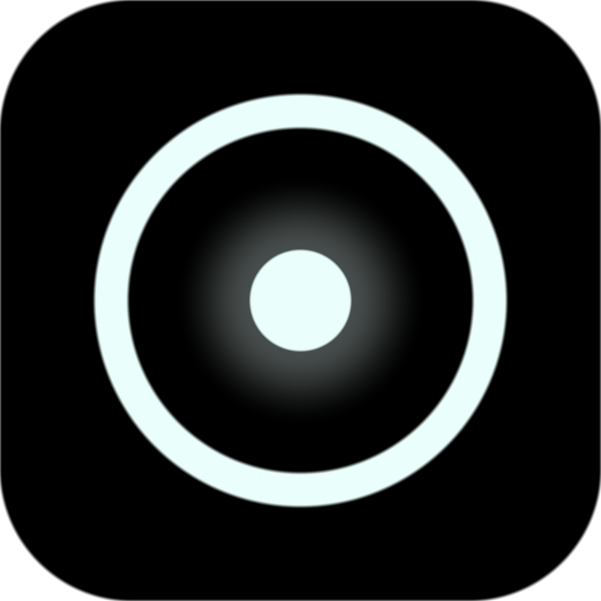

<div align="center">



# Gronk

**Grok on your desktop.**

Your projects, your sessions, your history — in a window instead of a terminal.

<br>

[](https://github.com/HesNotTheGuy/gronk/actions/workflows/ci.yml)
[](https://github.com/HesNotTheGuy/gronk/releases/latest)
[](LICENSE)


<br>

[**Download**](#download) · [**Features**](#features) · [**Requirements**](#requirements) · [**Security**](#security) · [**Build**](#build-from-source)

</div>

<br>

<picture>
  <source media="(prefers-color-scheme: dark)" srcset="docs/images/home.png">
  
</picture>

<p align="center"><sub><em>Pure-black chrome, the rock mark, Focus mode, and your recent projects at a glance.</em></sub></p>

<br>

> [!NOTE]
> **Every release ships installers for Windows, macOS and Linux.** Day-to-day development is Windows-first; the macOS and Linux builds come from CI and get less hands-on use — please report anything that only fails there.

---

## Download

<table>
<tr>
<td align="center" width="33%">

### Windows

`Gronk.Setup.<version>.exe`  
Install, or run portable:

`Gronk.<version>.exe`

</td>
<td align="center" width="33%">

### macOS

`Gronk-<version>-universal.dmg`

Apple Silicon & Intel

</td>
<td align="center" width="33%">

### Linux

`Gronk-<version>.AppImage`

`gronk_<version>_amd64.deb`

</td>
</tr>
</table>

<p align="center">
  <a href="https://github.com/HesNotTheGuy/gronk/releases/latest"><strong>Get the latest release →</strong></a>
</p>

Installers are unsigned, so your OS will warn you on first launch. On macOS, right-click the app and choose **Open**. On Windows, click **More info** then **Run anyway**. `SHA256SUMS.txt` on the release verifies the download arrived intact — integrity, not authorship.

---

## Features

Gronk runs your local `grok` binary as a child process and talks to it over ACP. No backend, no bundled credentials, no model calls of its own. You sign in with your own Grok account. Sign out lives in Settings, next to the account it acts on.

<table>
<tr>
<td width="50%" valign="top">

### Chat & Build

Two surfaces — the difference is whether your files are involved.

| | |
|---|---|
| **Chat** | A conversation. No project folder, so nothing reads or edits your files. |
| **Build** | Grok pointed at a folder on your computer, where it can read, edit and run. |

The shell is pure black with the rock brand mark in the rail. **Focus** (topbar button, or `[` when you are not typing in a field) hides the sidebar and the idle session tray so the conversation fills the frame.

</td>
<td width="50%" valign="top">

<picture>
  
</picture>

<sub>Tool call cards for read, edit, and shell — with diffs.</sub>

</td>
</tr>
</table>

<br>

<table>
<tr>
<td width="50%" valign="top">

<picture>
  
</picture>

<sub>Deny is the default. The dialog tells you when text came from the model.</sub>

</td>
<td width="50%" valign="top">

### Approve before anything runs

Edits show you the diff. Commands show you the command. Deny is the default button, and the dialog tells you when text came from the model rather than from Gronk.

<br>

### Watch the agent work

Every tool call becomes a card — reads, edits and shell commands, with diffs. Spawned agents show as a row of status dots under the turn that started them: dim when finished, red when failed, pulsing while live. The Agents tab in the session tray keeps that history until you dismiss it, and no longer opens itself when work starts.

</td>
</tr>
</table>

<br>

<table>
<tr>
<td width="50%" valign="top">

### Find any conversation

Search titles and message text across Chat and Build at once. Results say where they matched and which surface they came from.

<picture>
  
</picture>

</td>
<td width="50%" valign="top">

### Skills & plugins

Every skill on your machine — yours and the ones bundled with the CLI. A skill is a folder containing `SKILL.md`. Dropping it into `~/.grok/skills` is the whole install.

<picture>
  
</picture>

<br>

Plugin cards show the account that published them, like `github.com/xai-org`. A marketplace name is a string anyone can set, so it is shown as a plain label and never as a badge. Gronk marks nothing as verified, because it cannot know.

<picture>
  
</picture>

</td>
</tr>
</table>

<br>

### Also included

<table>
<tr>
<td align="center"><strong>Activity</strong><br><sub>Heatmap & cost per session</sub></td>
<td align="center"><strong>Sessions</strong><br><sub>Restore, rename, archive, export</sub></td>
<td align="center"><strong>Preview</strong><br><sub>Dev server beside the chat</sub></td>
<td align="center"><strong>Extensions</strong><br><sub>MCP, plugins & skills</sub></td>
<td align="center"><strong>Input</strong><br><sub>Mentions, paste, drag & drop</sub></td>
<td align="center"><strong>Themes</strong><br><sub>Light and dark</sub></td>
</tr>
</table>

---

## Requirements

<table>
<tr>
<td width="50%">

**1. The Grok CLI** — on your PATH.

```bash
# Windows
irm https://x.ai/cli/install.ps1 | iex

# macOS & Linux
curl -fsSL https://x.ai/cli/install.sh | bash
```

</td>
<td width="50%">

**2. Your own Grok account.**

Sign in from Gronk, or run `grok login`.

<br>

Node.js is **not** required. The installer bundles its own runtime.

</td>
</tr>
</table>

---

## Security

<table>
<tr>
<td width="50%">

- `contextIsolation: true`, `nodeIntegration: false` — the renderer gets a typed bridge, no Node access.
- Every IPC handler checks its sender before doing anything else.
- Agent file access is confined to the project directory, enforced on the resolved real path so symlinks cannot escape.

</td>
<td width="50%">

- Credentials stay in the Grok CLI. Gronk never stores or forwards a token.
- Dependencies install with lifecycle scripts disabled and are scanned against a known-malware dataset. See [docs/supply-chain.md](docs/supply-chain.md).

</td>
</tr>
</table>

> Your conversations are stored on your machine as readable text, which is what comparable tools do. Do not paste secrets into a chat.

---

## Build from source

Needs **Node.js 22.18 or newer** for the test runner's native type stripping.

```bash
npm ci --ignore-scripts
npm run dev
```

Or use the guarded install — disables lifecycle scripts, scans what landed, then fetches only the Electron binary:

```bash
npm run setup
```

> Bare `npm install` is discouraged. npm supply chain worms run in lifecycle scripts.

```bash
npm run verify      # typecheck and tests
npm run dist:win    # installers, per platform
```

macOS installers can only be built on macOS. Run the **Build installers** workflow from the Actions tab if you do not have one.

<details>
<summary><strong>Checks that need a screen</strong></summary>

<br>

`npm run verify` runs in CI on every push. These two need a display, so they run locally before a release:

```bash
npm run test:visual     # render 38 app states, compare against the baseline
npm run test:preview    # drive the dev-server preview under real Electron
```

`test:visual` exists because the rest of the suite cannot see the screen. The activity heatmap once shipped with no CSS at all and every test passed, because they asserted its data and the data was correct. When a state changes, look at the magenta regions in `tests/visual/diff/`, then accept it with `npm run test:visual:update` if the change was intended.

Baselines are rendered by one machine's font stack, so comparing them on a different OS reports differences that are not regressions. Close every other Gronk window before running the harness: it drives by clicking text, and a live app window will receive those clicks.

</details>

---

## Contributing

See [CONTRIBUTING.md](CONTRIBUTING.md). Security issues go through [SECURITY.md](SECURITY.md), not the issue tracker.

---

## Licence

Apache 2.0 — see [LICENSE](LICENSE) and [NOTICE](NOTICE).

You may use, modify and ship Gronk commercially, including in closed source products. The licence does not grant rights to the Gronk name or logo.

**The Grok CLI is not part of Gronk and is not redistributed here.** Gronk launches whichever binary you installed yourself, under xAI's terms, with your own account.

Gronk is an independent project, not affiliated with or endorsed by xAI. "Grok" is a trademark of xAI, used here only to describe what this app connects to.

Bundled packages are credited in [THIRD-PARTY-NOTICES.md](THIRD-PARTY-NOTICES.md).

---

<div align="center">

<sub>Made with the rock.</sub>

</div>
