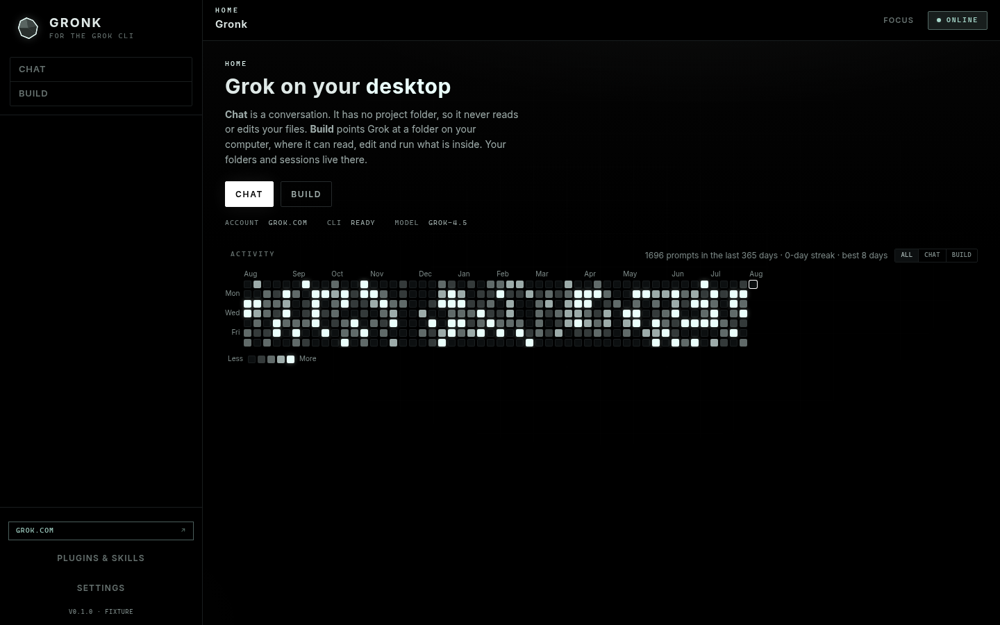
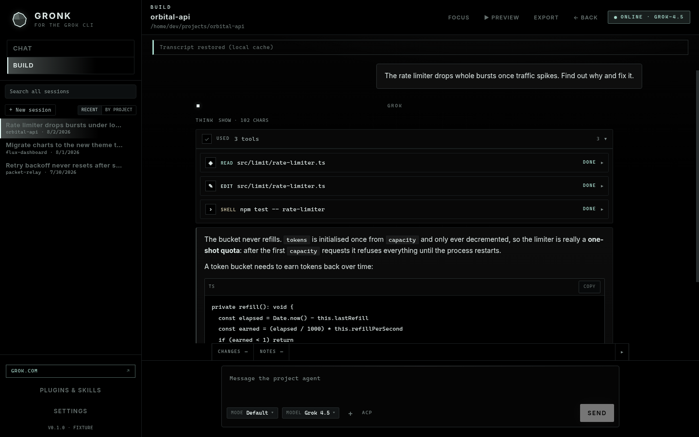
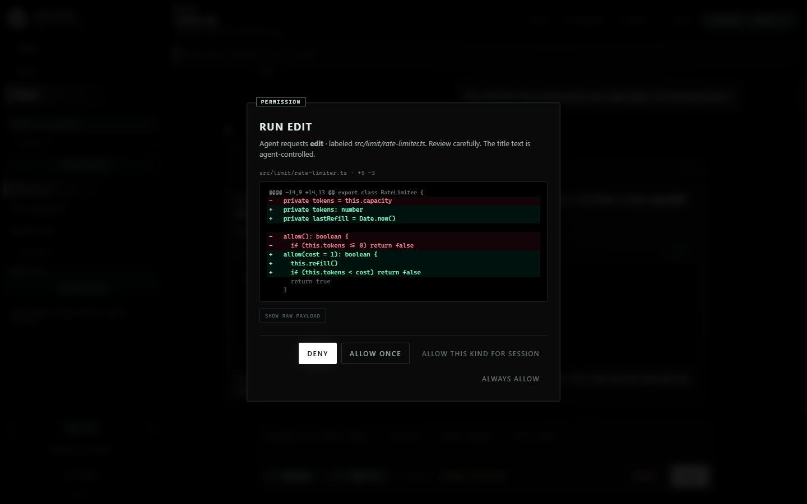
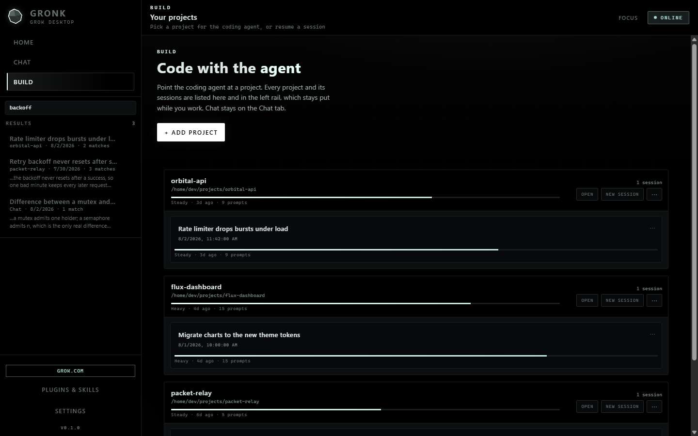
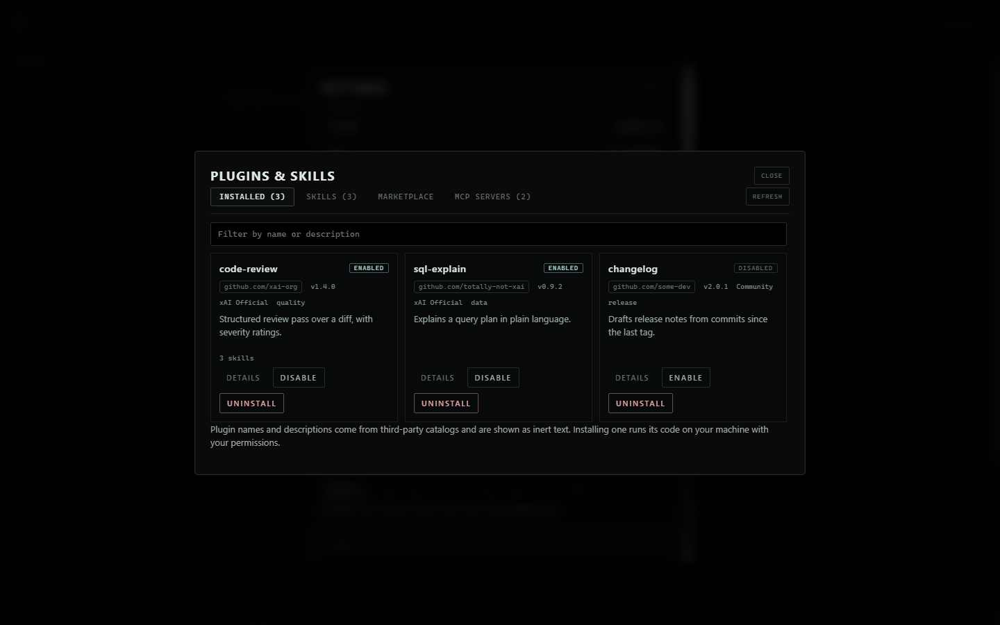

# Gronk

A desktop app for the [Grok Build CLI](https://x.ai). Your projects, your
sessions, your history, in a window instead of a terminal.



> **Pre-release.** Built and tested on Windows. The macOS and Linux installers
> come from CI and have not been run by the author yet. Reports welcome.

## Download

[**Latest release**](https://github.com/HesNotTheGuy/gronk/releases/latest) for
Windows, macOS and Linux.

Installers are unsigned, so your OS will warn you on first launch. On macOS,
right-click the app and choose **Open**. On Windows, click **More info** then
**Run anyway**.

## What it does

Gronk runs your local `grok` binary as a child process and talks to it over ACP.
No backend, no bundled credentials, no model calls of its own. You sign in with
your own Grok account.

| | |
|---|---|
| **Chat** | General conversation. No folder needed. |
| **Build** | A coding agent pointed at a project on your computer. |

### Watch the agent work

Every tool call becomes a card. Reads, edits and shell commands, with diffs.



### Approve before anything runs

Edits show you the diff. Commands show you the command. Deny is the default
button, and the dialog tells you when text came from the model rather than from
Gronk.



### Find any conversation

Search titles and message text across Chat and Build at once. Results say where
they matched and which surface they came from.



### See your skills

Every skill on your machine, yours and the ones bundled with the CLI. A skill is
a folder containing `SKILL.md`. Dropping it into `~/.grok/skills` is the whole
install.


### Know where a plugin came from

Plugin cards show the account that published them, like `github.com/xai-org`.
A marketplace name is a string anyone can set, so it is shown as a plain label
and never as a badge. Gronk marks nothing as verified, because it cannot know.



### Also

- Activity heatmap of your own work
- Token and cost accounting per session
- Session restore, rename, archive, export
- MCP servers and plugins, managed in app
- Attached preview for a dev server you are running
- File mentions, image paste, drag and drop
- Light and dark themes

## Requirements

1. **The Grok CLI**, on your PATH.
   - Windows: `irm https://x.ai/cli/install.ps1 | iex`
   - macOS and Linux: `curl -fsSL https://x.ai/cli/install.sh | bash`
2. **Your own Grok account.** Sign in from Gronk, or run `grok login`.

Node.js is not required. The installer bundles its own runtime.

## Security

- `contextIsolation: true`, `nodeIntegration: false`. The renderer gets a typed
  bridge and no Node access.
- Every IPC handler checks its sender before doing anything else.
- Agent file access is confined to the project directory, enforced on the
  resolved real path so symlinks cannot escape.
- Credentials stay in the Grok CLI. Gronk never stores or forwards a token.
- Dependencies install with lifecycle scripts disabled and are scanned against a
  known-malware dataset. See [docs/supply-chain.md](docs/supply-chain.md).

Your conversations are stored on your machine as readable text, which is what
comparable tools do. Do not paste secrets into a chat.

## Build from source

Needs **Node.js 22.18 or newer** for the test runner's native type stripping.

```bash
npm ci --ignore-scripts
npm run dev
```

Or use the guarded install, which disables lifecycle scripts, scans what landed,
then fetches only the Electron binary:

```bash
npm run setup
```

Bare `npm install` is discouraged. npm supply chain worms run in lifecycle
scripts.

```bash
npm run verify      # typecheck and tests
npm run dist:win    # installers, per platform
```

macOS installers can only be built on macOS. Run the "Build installers" workflow
from the Actions tab if you do not have one.

### Checks that need a screen

`npm run verify` runs in CI on every push. These two need a display, so they run
locally before a release:

```bash
npm run test:visual     # render 30 app states, compare against the baseline
npm run test:preview    # drive the dev-server preview under real Electron
```

`test:visual` exists because the rest of the suite cannot see the screen. The
activity heatmap once shipped with no CSS at all and every test passed, because
they asserted its data and the data was correct. When a state changes, look at
the magenta regions in `tests/visual/diff/`, then accept it with
`npm run test:visual:update` if the change was intended.

Baselines are rendered by one machine's font stack, so comparing them on a
different OS reports differences that are not regressions.

## Contributing

See [CONTRIBUTING.md](CONTRIBUTING.md). Security issues go through
[SECURITY.md](SECURITY.md), not the issue tracker.

## Licence

Apache 2.0. See [LICENSE](LICENSE) and [NOTICE](NOTICE).

You may use, modify and ship Gronk commercially, including in closed source
products. The licence does not grant rights to the Gronk name or logo.

**The Grok CLI is not part of Gronk and is not redistributed here.** Gronk
launches whichever binary you installed yourself, under xAI's terms, with your
own account.

Gronk is an independent project, not affiliated with or endorsed by xAI. "Grok"
is a trademark of xAI, used here only to describe what this app connects to.

Bundled packages are credited in
[THIRD-PARTY-NOTICES.md](THIRD-PARTY-NOTICES.md).
